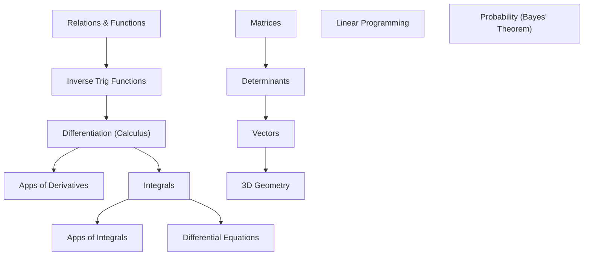
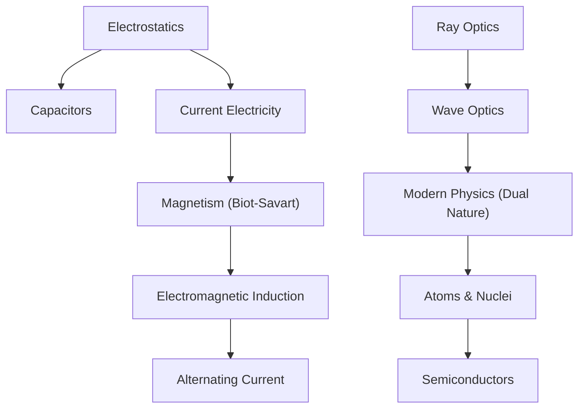
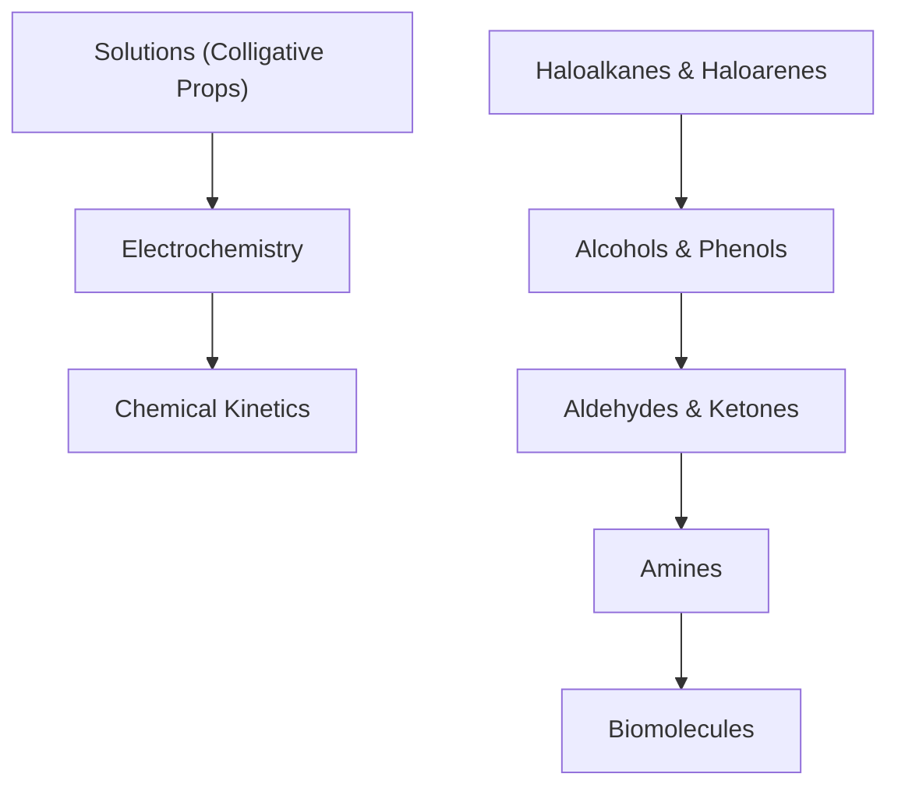
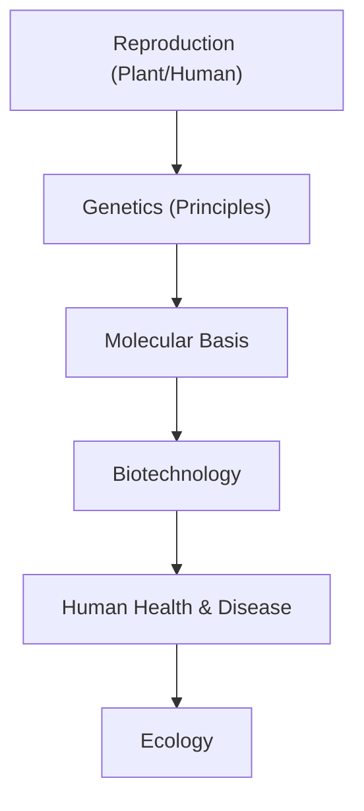

# Concept Graph Navigator — 12th Grade Edition

## The "Prerequisite" Trap in 12th Grade
12th Grade subjects are highly **Linear**. You cannot understand Chapter 7 if Chapter 1 is weak. Most students struggle with "Calculus" because their "Trigonometry" or "Limits" from 11th grade (and basic Algebra) are shaky.

---

## 📐 Mathematics Dependency Graph

**Critical Chain:** Differentiation $\to$ Integration $\to$ Differential Equations. If you break this chain, you lose 35 marks instantly.

---

## 🔭 Physics Dependency Graph

**Critical Chain:** Electrostatics is the "Grammar" of Physics. If you don't understand *Electric Field*, you will struggle with *Magnetic Force* and *AC Circuits*.

---

## 🧪 Chemistry Dependency Graph

**Critical Chain:** Organic Chemistry is a single unit. Haloalkanes is the foundation. If you miss the "Nucleophilic Substitution" logic in Ch 1, you will fail the rest of Organic.

---

## 🧬 Biology Dependency Graph

**Critical Chain:** Genetics $\to$ Molecular Basis $\to$ Biotechnology. This block is 30% of your paper.

---

## /graph-path Command Logic

Whenever the student says "I'm struggling with [Topic]", the AI should run the `/graph-path` analysis:

**EXAMPLE:**
> Student: "I can't solve Differential Equations."
> AI Analysis: 
> 1. Target: Differential Equations
> 2. Root 1: Basic Integration (Ch 7)
> 3. Root 2: Basic Differentiation (Ch 5)
> 4. Fix: Revise the 'Integrating Factor' logic and basic derivative formulas first.

---

## 💡 The Senior Sibling Advice
Don't jump to the hardest chapter first. Look at this graph. Fix the **Root Node** (the chapter at the top of the chain) first, and the rest of the tree will fall into place.
